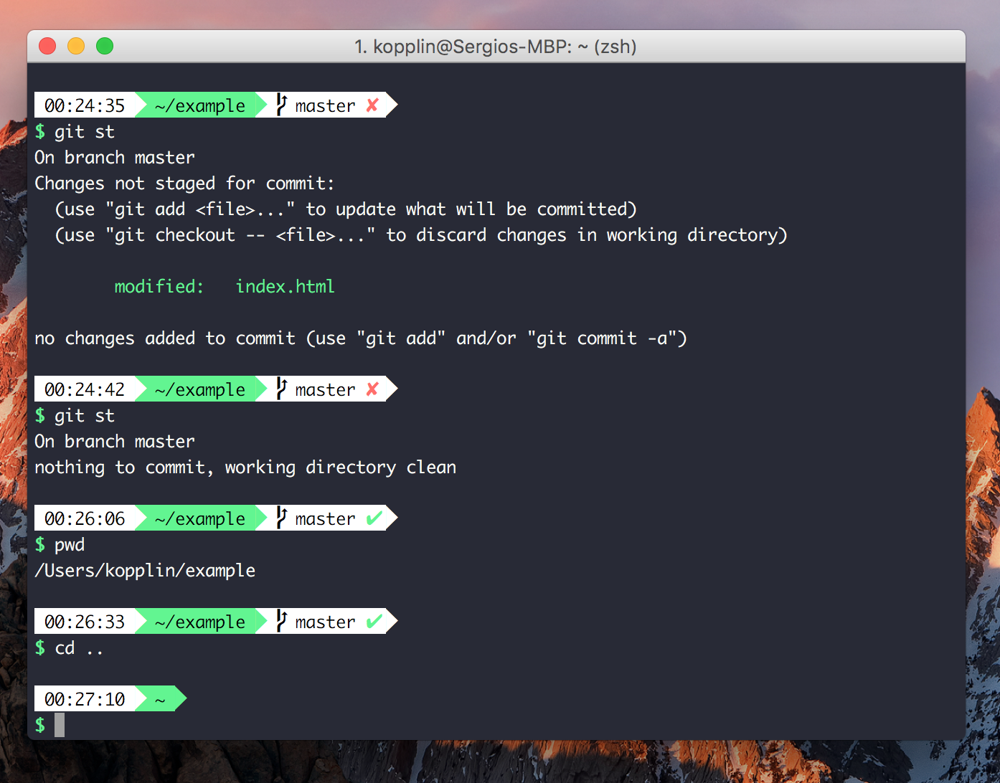

# Chartreuse [zsh](http://zsh.org) theme.

> A green theme for [zsh](http://zsh.org).



## Requirements:
- Powerline compatible fonts like [Vim Powerline patched fonts](https://github.com/Lokaltog/powerline-fonts), [Input Mono](http://input.fontbureau.com/) or [Monoid](http://larsenwork.com/monoid/).

## Install using git:

Clone the repo, then create a symbolik link to oh-my-zsh's theme folder:

```
$ git clone https://github.com/sergiokopplin/chartreuse.git ~/chartreuse
$ ln -s ~/chartreuse/chartreuse.zsh-theme ~/.oh-my-zsh/themes/chartreuse.zsh-theme
```

## Install manually:

Download using the [GitHub .zip](https://github.com/sergiokopplin/chartreuse/archive/master.zip) download option and unzip them.
Move chartreuse.zsh-theme file to oh-my-zsh's theme folder: ~/oh-my-zsh/themes/chartreuse.zsh-theme.

## Activating:

Go to your ~/.zshrc file and set ZSH_THEME="chartreuse".

## iTerm 2 theme:

Update your iTerm theme with this [fork](https://github.com/sergiokopplin/iterm)

---

### Inspiration:

Colors from [Dracula](https://draculatheme.com/) and zsh config from [Bullet Train](https://github.com/caiogondim/bullet-train-oh-my-zsh-theme).

---

[MIT](http://kopplin.mit-license.org/) License © Sérgio Kopplin
